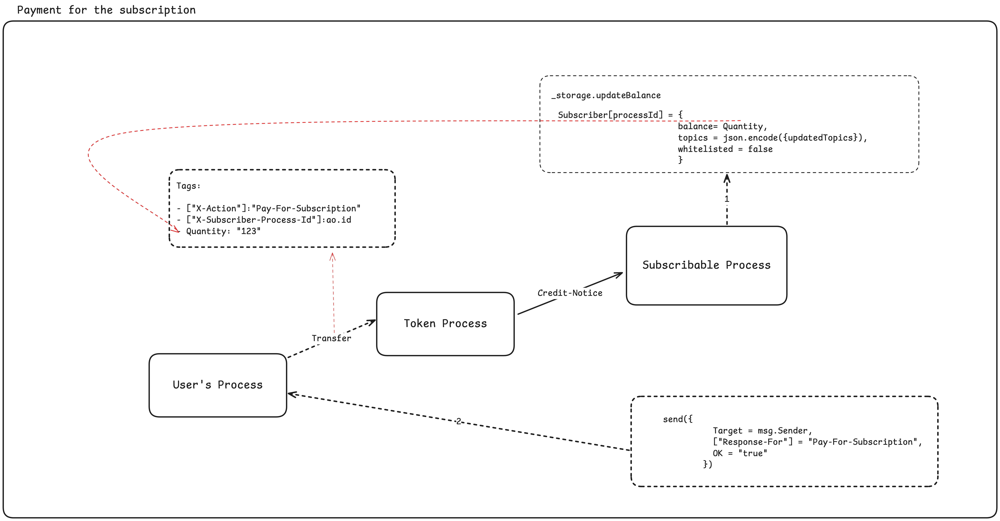

# Price Oracle Subscription

`price_oracle` is a subscribable process which sends the notification to the subscribers on every price update.

## Tutorial Video

<iframe width="560" height="315" src="https://www.youtube.com/embed/5faPa57A9Is?si=7HlI2pms1kvXJe6o" title="YouTube video player" frameborder="0" allow="accelerometer; autoplay; clipboard-write; encrypted-media; gyroscope; picture-in-picture; web-share" referrerpolicy="strict-origin-when-cross-origin" allowfullscreen></iframe>

## Tools Utilized

- Off-chain price for **$AR** is being fetched using **[0rbit](https://0rbit.co)**.
- The subscription on an AO process was implemented by the Subscribable Package by Autonomous Finance.
- `apm-tool` was used to install subscribable and 0rbit package.
- betterIDEa was used to test the process.

## How to Start

### Step 1: Price Oracle Subscribable Process [Terminal 1]

1. Start AOS

    ```bash
    aos price_oracle
    ```

2. Load `price_oracle.lua` file in your process

    ```bash
    .load price_oracle.lua
    ```

3. Fund `price_oracle` process Id with [$0RBT](https://docs.0rbit.co/protocol/token/how-to-get)
   - DM [@megabyte0x](x.com/megabyte0x) or [@lucifer0x17](x.com/lucifer0x17) or [@0rbit](x.com/0rbit.co) to get $0RBT

### Step 2: Subscribing to Price Oracle Subscribable Process [Terminal 2]

1. Start AOS

    ```bash
    aos subscriber
    ```

2. Send the message to `Register-Subscriber`

    ```bash
    Send({
        Target = <PRICE_ORACLE_PROCESS_ID>,
        Action = 'Register-Subscriber',
        Topics = json.encode({ 'price-update' })
    })
    ```

3. Fund the `Subscriber` process ID with `$0RBT`
4. Send the message to `Pay-For-Subscription`

    ```bash
    send({
            Target = 0RBT,
            Action = 'Transfer',
            Recipient =  <PRICE_ORACLE_PROCESS_ID>,
            Quantity = "1000000000000",
            ["X-Action"] = "Pay-For-Subscription",
            ["X-Subscriber-Process-Id"] = ao.id
        })
    ```

### Step 3: Updating the price [Terminal 1]

1. Send the message to update the price

    ```bash
    Send({Target = ao.id, Action="UpdatePrice"})
    ```

---
After following the above steps you will receive a message on Terminal 2 (Subscriber Process) with updated price.

---

## Subscription Overview

### Register Subscriber


### Pay for Subscription

